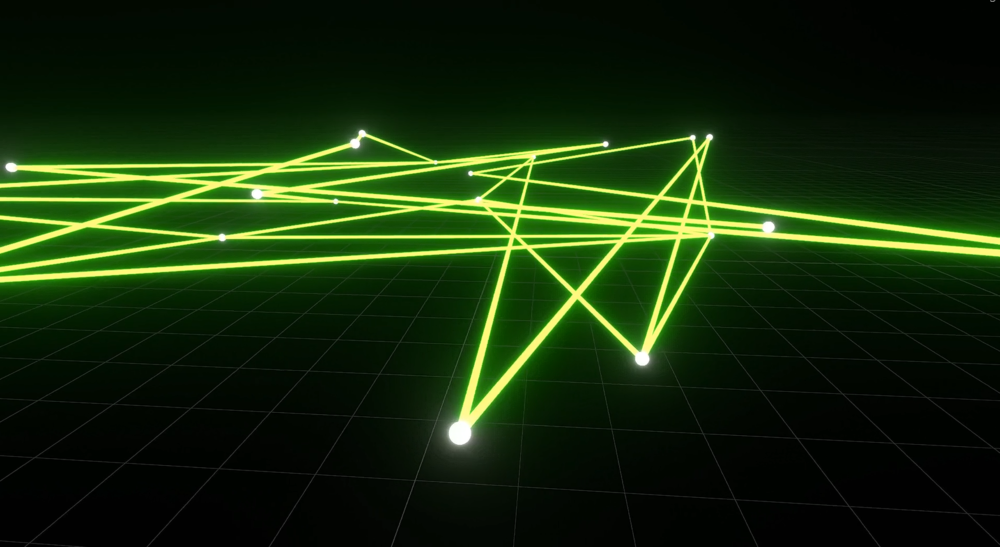

# A* Pathfinding in Blender 3D (Cities: Skylines–style)

Build a simple **city grid** inside Blender where **intersections** are icospheres and **roads** are cylinders.  
The pipeline:
1) Generate random intersections → write their coordinates.
2) Randomly connect them with cylinders → write an adjacency list with edge weights.
3) Run a pure-Python **A\*** to find a path between two node IDs and draw the path in 3D.

**Scripts**
- `scripts/generateANDWriteNodeCoordinates.py` — creates icospheres, writes `data/icosphere_coordinates.txt`
- `scripts/generateRandomCylindersANDSetKeyframes.py` — connects nodes with cylinders, writes `data/adjacency_list.txt`
- `scripts/Astar.py` — loads both files, runs A*, draws the result path + start/end markers

<p align="center">
  
</p>

---

## Requirements
- **Blender 4.0+** (uses bundled Python)
- No external packages required

---

## Quickstart (Blender UI)
1. Open **Blender**, switch to the **Scripting** workspace.
2. In the Text Editor, open and **Run**:  
   **A)** `scripts/generateANDWriteNodeCoordinates.py`  
   - Spawns `num_icospheres` nodes (Icospheres) and adds a simple Z animation.
   - Writes `data/icosphere_coordinates.txt` with one node per line:
     ```
     [0, -0.52, 3.17, 0.00]
     [1,  2.31, 1.22, 0.50]
     ...
     ```

   **B)** `scripts/generateRandomCylindersANDSetKeyframes.py`  
   - Reads `data/icosphere_coordinates.txt`, connects nodes with cylinders (roads).
   - Computes **edge weights** (Euclidean distances) and writes `data/adjacency_list.txt` like:
     ```
     0: [(1, 3.42), (7, 1.98)]
     1: [(0, 3.42), (4, 2.77)]
     ...
     ```

   **C)** `scripts/Astar.py`  
   - Loads both files, runs A* from `start_node` to `end_node`, and **draws the path** with cylinders using material **"Result"**.  
   - Drops icospheres with material **"Point"** at start & goal.

> After (C), press **Play** to view the simple keyframed animations.

---

## Parameters you’ll edit

### `scripts/generateANDWriteNodeCoordinates.py`
- `num_icospheres` — how many intersections to generate (default: 20)
- `scale` — icosphere radius (default: `0.072`)
- `z_range`, `frame_start`, `frame_end` — Z animation window

**Output:** `data/icosphere_coordinates.txt` with `[node_id, x, y, z]` (rounded to 2 d.p.)

### `scripts/generateRandomCylindersANDSetKeyframes.py`
- Randomly creates connections and adds keyframes to cylinders (`frame_start=200`, `frame_end=272`).
- Writes `data/adjacency_list.txt` as `node: [(neighbor, weight), ...]`.

**Important:** Ensure Euclidean distance uses a **square-root** (`**0.5`), not `**(1/3)`.  
In the file:
```python
def euclidean_distance(coord1, coord2):
    return (sum((c1 - c2) ** 2 for c1, c2 in zip(coord1, coord2))) ** 0.5
